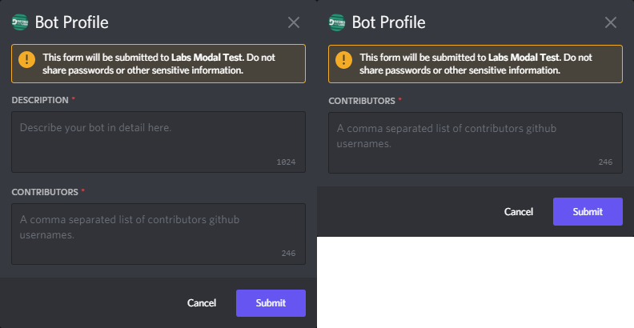
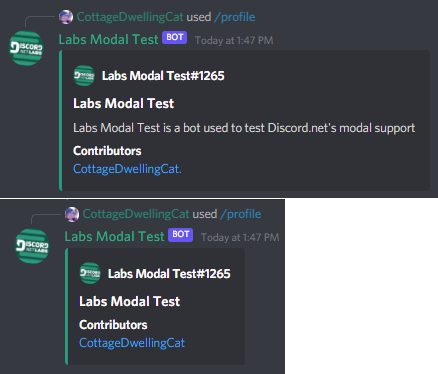

# Advanced Modals
Larger and more complex modals present additional challenges for 
getting and validating input. In this case we have a command that 
allows users to create a custom embed for their bot. 

We start by creating a slash command to launch the modal from.
```cs
enum ProfileType
{
    Default,
    NoDescription
}

[SlashCommand("profile", "create a fancy profile for your bot")]
public async Task Profile(IGuildUser user, ProfileType type)
{
    // make sure the bot is valid
    if (!user.IsBot)
    {
        await RespondAsync("The user must be a bot", ephemeral: true);
    }
}
```
Then we get the modal to send based on the user's input:
```cs
List<IMessageComponent> components = new();

ModalBuilder mb = new ModalBuilder()
    .WithCustomId($"{type}_{user.Id}")
    .WithTitle("Bot Profile");

if (type is ProfileType.Default or not ProfileType)
{
    var description = new TextInputBuilder()
        .WithCustomId("profile_description")
        .WithLabel("description")
        .WithMaxLength(1024)
        .WithPlaceholder("Describe your bot in detail here.")
        .WithStyle(TextInputStyle.Paragraph);
    components.Add(description.Build());
}

var contributors = new TextInputBuilder()
    .WithCustomId("profile_contrib")
    .WithLabel("Contributors")
    .WithMaxLength(246)
    .WithStyle(TextInputStyle.Paragraph)
    .WithPlaceholder("A comma separated list of contributors github usernames.");
components.Add(contributors.Build());
```
Next we build and respond to the interaction:
```cs
mb.AddComponents(components, 0);
await Context.Interaction.RespondWithModalAsync(mb.Build());
```

After that we should see the modal dynamically updating to our choice:



Now we need to get input from our modal. Because some components on 
the modal are optional, we will create a `Dictionary` consisting 
of the component's `CustomId`s and `Value`s for easier usage.

```cs
// Get the user.
ulong userId = Convert.ToUInt64(modal.Data.CustomId.Split('_')[1]);
IUser user = await client.GetUserAsync(userId);

// Make a Dictionary of components CustomId and Value.
Dictionary<string, string> values = modal.Data.Components
	.ToDictionary(x => x.CustomId, x => x.Value);

// Grab the github profile of contributors.
string contributors = string.Concat(values["profile_contrib"]
	.Split(',')
	.Select(x => $"[{x}](https://github.com/{x})\n"));

// The description field uses 'GetValueOrDefault so the returned value 
// is null when descriptions are unspecified, instead of throwing an error.
var eb = new EmbedBuilder()
	.WithTitle(user.Username)
	.WithAuthor(user)
	.WithDescription(values.GetValueOrDefault("profile_description"))
	.AddField("Contributors", contributors)
    .WithColor(0x1a9b7c);

await modal.RespondAsync(embed:eb.Build());
```
Now when we run the command and respond to the modal we should get a 
customized modal with information about our bot.


